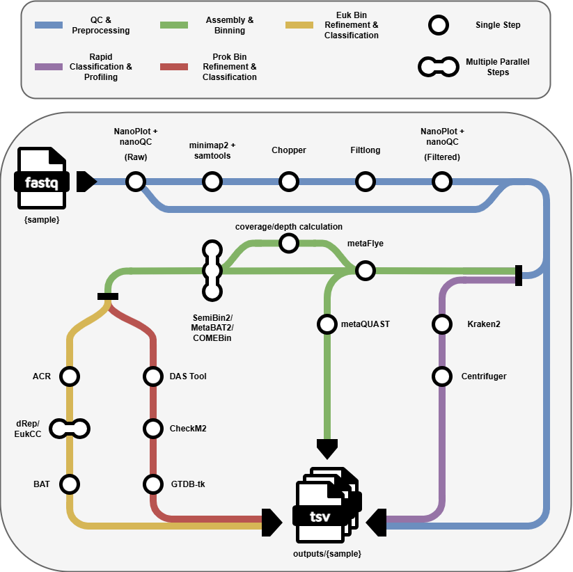

# Long-read metagenomics pipeline

Snakemake workflow for long-read shotgun metagenomic analysis of Oxford Nanopore sequencing data.

This pipeline supports two complementary analysis branches:

1. **Read-level taxonomic classification and profiling**, which provides rapid compositional profiling directly from sequencing reads.
2. **Assembly-based genome reconstruction**, which performs metagenomic assembly, read mapping, coverage calculation, binning, bin refinement, genome quality estimation and genome-level taxonomic classification.

The workflow is controlled through a central `config.yaml` file and is designed to run with Singularity/Apptainer containers.

> **Note:** This repository was developed as part of a master thesis project on reproducible long-read shotgun metagenomics pipeline development and benchmarking. Some paths, database locations and resource settings may need to be adapted before running the workflow on another system.





## Contents

- [Pipeline overview](#pipeline-overview)
- [Repository structure](#repository-structure)
- [Requirements](#requirements)
- [Input data](#input-data)
- [Configuration](#configuration)
- [Databases](#databases)
- [Containers](#containers)
- [Preparing a run and running the pipeline](#preparing-and-running)
- [Output structure](#output-structure)
- [Acknowledgements](#acknowledgements)

## Pipeline overview

The workflow starts from long-read FASTQ files and can run either the profiling branch, the genome reconstruction branch or both.

The main workflow steps are:

1. **Raw read quality control**
   - NanoPlot
   - nanoQC

2. **Optional preprocessing**
   - Host read removal with minimap2 and samtools
   - Length and quality filtering with Chopper
   - Additional read filtering with Filtlong
   - Post-filtering quality control with NanoPlot and nanoQC

3. **Read-level taxonomic profiling**
   - Kraken2
   - Centrifuger

4. **Metagenomic assembly**
   - metaFlye

5. **Optional assembly quality control**
   - MetaQUAST

6. **Read mapping and coverage calculation**
   - minimap2
   - samtools
   - `jgi_summarize_bam_contig_depths`

7. **Metagenomic binning**
   - MetaBAT2
   - SemiBin2
   - COMEBin

8. **Prokaryotic bin refinement and classification**
   - DAS Tool
   - CheckM2
   - GTDB-Tk

9. **Eukaryotic bin refinement and classification**
   - ACR
   - dRep
   - EukCC
   - BAT

10. **Final reporting**
   - Genome inventory
   - Genome summary
   - Bin trace
   - Pipeline summary


## Repository structure

```text
lr_mg_pipeline_final/
├── README.md
├── Snakefile
├── config.yaml
├── run.sh
├── rules/
│   ├── common.smk
│   ├── qc.smk
│   ├── preprocessing.smk
│   ├── taxonomy.smk
│   ├── assembly.smk
│   ├── mapping.smk
│   ├── binning.smk
│   ├── refine_prok.smk
│   ├── refine_euk.smk
│   ├── reporting.smk
│   └── targets.smk
├── scripts/
│   ├── bins_to_contig2bin.py
│   ├── collect_all_bins.py
│   ├── host_removal_mm2.sh
│   ├── keep_euk_bins.py
│   ├── merge_final_reports.py
│   ├── report_pipeline_summary.py
│   └── select_best_euk_bins.py
├── containers/
│   └── def/
│       ├── assembly.def
│       ├── comebin.def
│       ├── euk.def
│       ├── metabat2.def
│       ├── preprocessing_qc.def
│       ├── prok.def
│       ├── semibin2.def
│       └── taxonomy.def
├── data/
│   ├── raw/
│   │   └── add_samples.md
│   └── host/
│       └── add_host.md
├── databases/
│   └── add_dbs.md
├── Alignments/
├── Assembly/
├── Binning/
├── Preprocessing/
├── QC/
├── Refinement/
├── Reports/
├── Stages/
└── Taxonomy/
```

## Requirements

Required software on the host system:

- Snakemake
- Singularity/Apptainer
- Python 3
- Bash


## Input data

Input FASTQ files should be placed in:

```text
data/raw/
```

For each sample listed in `config.yaml`, the pipeline expects a matching FASTQ file in `data/raw/`.


## Configuration

The pipeline is controlled through:

```text
config.yaml
```

## Databases

The workflow does not automatically download or build external databases. Required databases must be prepared before running the pipeline and their paths must be set in `config.yaml`.

- Kraken2 requires a Kraken2 database.
- Centrifuger requires a Centrifuger index/database prefix.
- CheckM2 requires the CheckM2 database file.
- GTDB-Tk requires the GTDB-Tk database.
- ACR requires the ACR database directory.
- EukCC requires the EukCC database.
- BAT requires the BAT database and taxonomy files.

Required databases depend on the selected workflow branches and tools.


## Containers

Tool execution is containerized with Singularity/Apptainer. Container paths are configured in `config.yaml`:

```yaml
containers:
  preprocessing_qc: "containers/sif/preprocessing_qc.sif"
  taxonomy: "containers/sif/taxonomy.sif"
  assembly: "containers/sif/assembly.sif"
  metabat2: "containers/sif/metabat2.sif"
  semibin2: "containers/sif/semibin2.sif"
  comebin: "containers/sif/comebin.sif"
  prok: "containers/sif/prok.sif"
  euk: "containers/sif/euk.sif"
```


## Preparing a run and running the pipeline

Before running the workflow, check the following:

1. Add input FASTQ files and host reference file.

The file names and paths should match the names and paths in `config.yaml`.

2. Add the required external databases.

Make sure all selected database paths in `config.yaml` are correct.

3. Build or provide the required Singularity/Apptainer images.

The expected container paths are defined in the `containers` section of `config.yaml`.

4. Edit and check `config.yaml`.

5. Run the pipeline directly or on a Slurm system with the provided `run.sh`.


## Output structure

Customer-facing outputs are grouped in top-level category folders:

```text
Alignments/
Assembly/
Binning/
Preprocessing/
QC/
Refinement/
Reports/
Taxonomy/
```
Main output directories include:

```text
QC/Raw/{sample}/                         Raw read quality control reports
QC/Filtered/{sample}/                    Post-filtering quality control reports
Preprocessing/{sample}/                  Preprocessed reads and host-removal metrics
Taxonomy/Kraken2/{sample}/               Kraken2 classification output
Taxonomy/Centrifuger/{sample}/           Centrifuger classification and quantification
Assembly/MetaFlye/{sample}/              metaFlye assembly output
Assembly/MetaQUAST/{sample}/             MetaQUAST assembly QC
Alignments/{sample}/                     Read alignments and contig depth files
Binning/{tool}/{sample}/                 Binning outputs and normalized tables
Refinement/{domain}/{tool}/{sample}/     Prokaryotic and eukaryotic refinement outputs
Reports/{sample}/                        Final per-sample summary tables and taxonomy JSON
```

The main Gaia HTML report is generated at:

```text
Reports/report.html
```

### Versions manifest handling

- `metadata/versions.json` is the single source of truth for tool versions.
- The `run` wrapper copies this file into the report folder as:

```text
Reports/versions.json
```

- The report renderer reads this copied `versions.json` and displays the versions table in `report.html`.
- Dynamic Python-based tool version collection is no longer part of the workflow.

## Acknowledgements

This workflow uses several open-source bioinformatics tools, including NanoPlot, nanoQC, minimap2, samtools, Chopper, Filtlong, Kraken2, Centrifuger, metaFlye, MetaQUAST, MetaBAT2, SemiBin2, COMEBin, DAS Tool, CheckM2, GTDB-Tk, ACR, dRep, EukCC and BAT.

Please cite the original tools if you use this workflow or adapt parts of it for downstream analyses.
